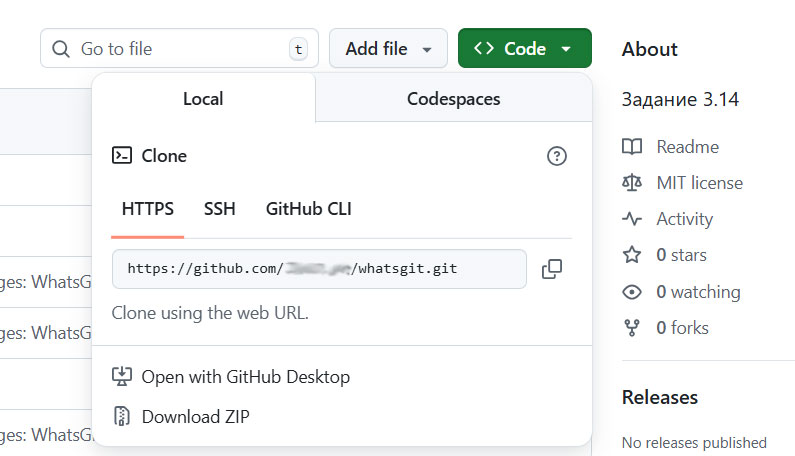

# 4. Создание репозитория

Репозиторий — это сердце Git. Это хранилище, где Git начинает отслеживать изменения в ваших файлах. 

Есть два основных способа создать репозиторий: создать новый локально или скопировать удаленный с GitHub.

## Создание нового репозитория (git init)

Этот способ используется, когда вы начинаете проект с нуля на своем компьютере.

1.  **Откройте терминал** (Git Bash, командную строку или терминал VS Code).
2.  **Перейдите в папку** вашего проекта (укажите путь):

    ```
    cd C:/Users/yourname/your-project
    ```

3.  **Выполните команду инициализации:**

    ```
    git init
    ```

**Что произойдет?**
Git создаст скрытую папку `.git` в вашей директории. В этой папке будет храниться вся история изменений и служебная информация.

**Результат в терминале:**
```
Initialized empty Git repository in C:/Users/yourname/your-project/.git/
```

Готово! Теперь ваша папка — это Git-репозиторий. Вы можете начать добавлять файлы и делать коммиты (эти команды мы разберем чуть позже).

## Создание копии репозитория (git clone)

Этот способ используется, когда вам нужно получить копию проекта, который уже существует на GitHub или другом удаленном сервере.

Найдите URL репозитория на GitHub.

### Шаги для получения HTTPS URL:

1. Откройте репозиторий: зайдите на главную страницу репозитория на GitHub, который вы хотите клонировать. 
2. Нажмите кнопку "Code": справа от списка файлов найдите и нажмите зеленую кнопку <> Code. 
3. Выберите HTTPS: в появившемся окне убедитесь, что выбрана вкладка HTTPS. 
4. Скопируйте URL: нажмите на иконку копирования (обычно два перекрывающихся квадрата), чтобы скопировать URL-адрес репозитория в буфер обмена. 



Теперь вы можете использовать этот URL для клонирования репозитория с помощью команд git clone. 

В терминале выполните команду clone и вставьте полученную ссылку:

```
git clone https://github.com/username/repository-name
```

Что произойдет?
Git скачает все файлы проекта и всю его историю изменений на ваш компьютер, создав папку с именем репозитория.

Если вы хотите клонировать репозиторий в каталог с другим именем, отличающимся от libgit2, необходимо указать желаемое имя, как параметр командной строки:

```
git clone https://github.com/username/repository-name othername
```

Эта команда аналогична предыдущей, но каталог будет назван othername.

---
| Следующий шаг |                                                                           
|:--------------|                                                                           
| Переходите к следующему разделу, чтобы освоить этот фундаментальный цикл: [Базовые команды: status, add, commit >>](basic-commands.md) |